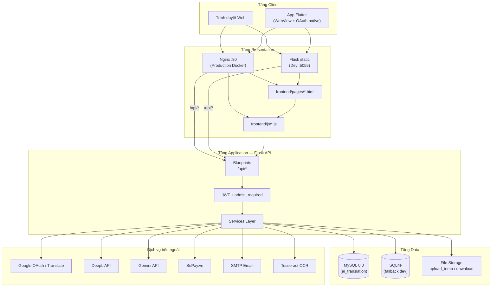
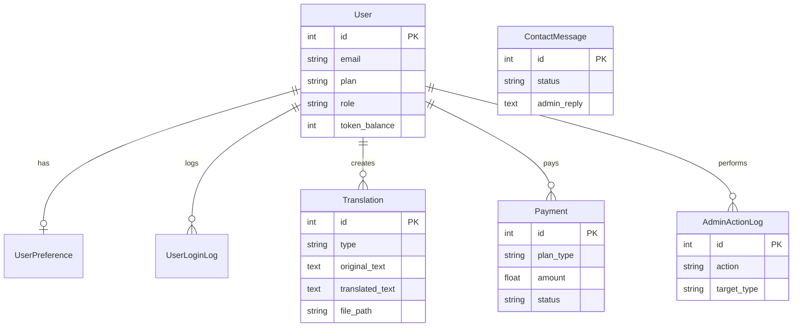
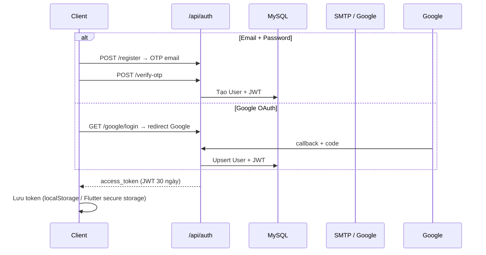
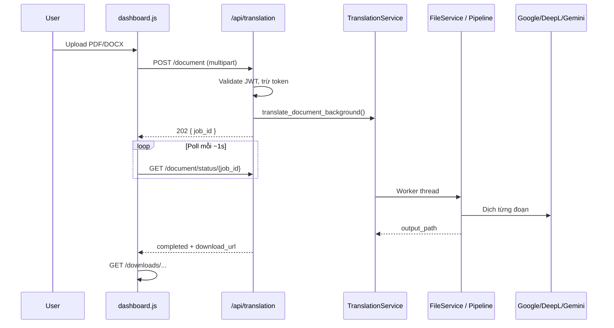
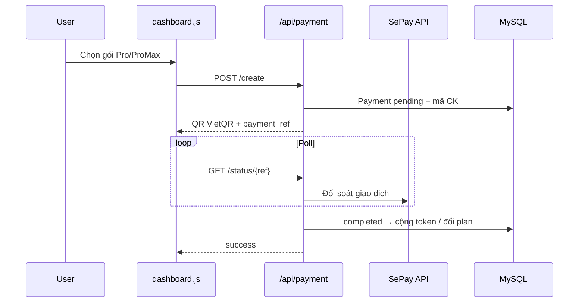

# Kiến trúc hệ thống — AI Translation System

Tài liệu mô tả **kiến trúc tổng thể**, **các tầng (layer)**, **thành phần phần mềm** và **luồng tương tác chính** của hệ thống dịch văn bản/tài liệu giữ định dạng gốc.

---

## 1. Mục tiêu kiến trúc

| Mục tiêu | Cách đạt được |
|----------|----------------|
| Dịch đa định dạng | Pipeline PDF/DOCX tách biệt trong `document_v2/` |
| Giữ layout tài liệu | PDF → DOCX → dịch → khôi phục layout → PDF |
| Mở rộng nhà cung cấp AI | `TranslationService` hỗ trợ Google / DeepL / Gemini |
| Đa nền tảng | Web (HTML/JS) + App Flutter (WebView + native auth) |
| Quản trị tập trung | Module `/admin` + API `/api/admin/*` |
| Thanh toán tự động | SePay + polling đối soát giao dịch |

---

## 2. Tổng quan kiến trúc

Hệ thống theo mô hình **Client — Server — Database**, API RESTful, xử lý tài liệu **bất đồng bộ** (background job + polling).



---

## 3. Thành phần hệ thống

### 3.1. Client

| Thành phần | Thư mục | Vai trò |
|------------|---------|---------|
| **Web UI** | `frontend/` | Dashboard dịch, profile, admin, thanh toán, lịch sử |
| **Mobile App** | `app_web_view (1)/app_web_view/` | Splash, login native, profile, WebView inject JWT → `/dashboard` |

### 3.2. Backend API

| Thành phần | Thư mục / file | Vai trò |
|------------|----------------|---------|
| **Entry point** | `api_base/run_api.py` | Khởi tạo Flask, DB, JWT, đăng ký Blueprint, serve static (dev) |
| **Cấu hình** | `api_base/app/config.py`, `.env` | DB URL, API keys, pipeline flags |
| **Routers** | `api_base/app/routers/` | Định tuyến HTTP → handler |
| **Services** | `api_base/app/services/` | Logic nghiệp vụ, gọi AI/OCR/email/payment |
| **Models** | `api_base/app/models/` | SQLAlchemy ORM |
| **Security** | `api_base/app/security/` | JWT, `admin_required` |

### 3.3. Cơ sở dữ liệu

| Thành phần | Ghi chú |
|------------|---------|
| **MySQL 8.0** | DB chính (Docker / XAMPP) |
| **SQLite** | Fallback tự động khi MySQL không khả dụng (dev) |
| **Schema** | `api_base/init_db.sql` + `db_migrations.py` |

### 3.4. Lưu trữ file

| Thư mục | Mục đích |
|---------|----------|
| `api_base/utils/upload_temp/` | File upload tạm khi xử lý |
| `api_base/utils/download/` | File dịch xong, phục vụ qua `/downloads/` |
| `api_base/fonts/` | Font Noto (PDF/DOCX) |
| `api_base/tessdata/` | Dữ liệu Tesseract OCR |

---

## 4. Kiến trúc phân lớp (Layered Architecture)

```
┌─────────────────────────────────────────────────────────┐
│  Presentation Layer                                     │
│  HTML pages, CSS, JavaScript (dashboard.js, admin.js…)  │
└──────────────────────────┬──────────────────────────────┘
                           │ HTTP / JSON / multipart
┌──────────────────────────▼──────────────────────────────┐
│  API Layer (Flask Blueprints)                           │
│  auth | translation | payment | history | admin | …     │
└──────────────────────────┬──────────────────────────────┘
                           │
┌──────────────────────────▼──────────────────────────────┐
│  Business / Service Layer                               │
│  TranslationService, FileService, PaymentService, …     │
└──────────────────────────┬──────────────────────────────┘
                           │
┌──────────────────────────▼──────────────────────────────┐
│  Data Access Layer                                      │
│  SQLAlchemy models + file I/O                           │
└──────────────────────────┬──────────────────────────────┘
                           │
┌──────────────────────────▼──────────────────────────────┐
│  MySQL / SQLite + File System                           │
└─────────────────────────────────────────────────────────┘
```

**Nguyên tắc:**

- Router **chỉ** validate request, auth, gọi service, trả JSON.
- Service **chứa** logic dịch, trừ token, pipeline file.
- Model **ánh xạ** bảng DB, không chứa logic phức tạp.

---

## 5. Module API (Blueprints)

| Prefix | Router | Chức năng chính |
|--------|--------|-----------------|
| `/api/auth` | `auth.py` | Đăng ký OTP, đăng nhập email/Google, profile, avatar |
| `/api/translation` | `translation.py` | Dịch text, document (async), image OCR, detect language |
| `/api/payment` | `payment.py` | Tạo hóa đơn, QR VietQR, poll trạng thái SePay |
| `/api/history` | `history.py` | Lịch sử bản dịch, xóa |
| `/api/admin` | `admin.py` | KPI, user, bản dịch, payment, liên hệ, audit log |
| `/api/contact` | `contact.py` | Form liên hệ, newsletter, tin nhắn của user |
| `/api/public` | `public.py` | Stats công khai (trang chủ) |
| `/api/ai` | `ai.py` | Cấu hình model AI hiển thị trên UI |

**Static routes (dev):** `run_api.py` map `/`, `/dashboard`, `/admin`, `/profile`, … → `frontend/pages/`.

---

## 6. Service Layer

| Service | File | Trách nhiệm |
|---------|------|-------------|
| **TranslationService** | `translation_service.py` | Gọi Google/DeepL/Gemini; job nền dịch document |
| **FileService** | `file_service.py` | Điều phối xử lý DOCX/PDF upload |
| **DocxService** | `docx_service.py` | Dịch DOCX giữ paragraph/run/style |
| **PdfService** | `pdf_service.py` | Tiện ích PDF (OCR, analyze) |
| **PDF-DOCX Pipeline** | `document_v2/pdf_docx_pipeline/` | 10 bước PDF → DOCX → dịch → PDF |
| **PaymentService** | `payment_service.py` | SePay, đối soát CK, cộng token/plan |
| **EmailService** | `email_service.py` | OTP, reset password, phản hồi liên hệ |
| **OtpService** | `otp_service.py` | Sinh/xác thực OTP đăng ký |

---

## 7. Mô hình dữ liệu (tóm tắt)



**Bảng chính:** `user`, `user_preference`, `user_login_log`, `auth_otp`, `translation`, `payment`, `contact_message`, `newsletter_subscriber`, `admin_action_log`.

Chi tiết cài DB: [DATABASE_SETUP.md](./DATABASE_SETUP.md).

---

## 8. Luồng xử lý chính

### 8.1. Xác thực



### 8.2. Dịch tài liệu (bất đồng bộ)



Chi tiết: [QUY_TRINH_DICH_FILE.md](../QUY_TRINH_DICH_FILE.md).

### 8.3. Thanh toán & nâng cấp gói



Chi tiết: [SEPAY_INTEGRATION.md](./SEPAY_INTEGRATION.md), [PAYMENT_POLLING_SYNC.md](../PAYMENT_POLLING_SYNC.md).

### 8.4. Quản trị

Admin đăng nhập (JWT + `role=admin`) → truy cập `/admin` → gọi `/api/admin/*` (stats, users, translations, payments, contacts, audit log).

Use case: [USE_CASE_DIAGRAM.md](./USE_CASE_DIAGRAM.md).

---

## 9. Bảo mật

| Cơ chế | Triển khai |
|--------|------------|
| **Xác thực** | JWT (`Flask-JWT-Extended`), hết hạn 30 ngày |
| **Phân quyền** | `role`: `user` \| `admin`; decorator `@admin_required` |
| **Mật khẩu** | Werkzeug `generate_password_hash` (bcrypt/scrypt) |
| **OTP** | Hash OTP, giới hạn số lần sai / resend |
| **CORS** | Flask-CORS (dev); Nginx proxy (prod) |
| **Upload** | Validate extension, giới hạn kích thước |
| **Audit** | `AdminActionLog` ghi hành động admin quan trọng |

Identity JWT: Google users → `google_id`; email users → `str(user.id)`.

---

## 10. Frontend Web

| Thư mục | Nội dung |
|---------|----------|
| `frontend/pages/` | Trang HTML: home, auth, dashboard, admin, profile, history… |
| `frontend/js/` | Logic: `dashboard.js`, `admin.js`, `auth.js`, `i18n.js` |
| `frontend/css/` | Theme dark, layout từng trang |
| `frontend/libs/` | Font Awesome (offline) |

**i18n:** Việt / Anh qua `i18n_data.js` + `i18n.js`.

**State:** JWT và profile lưu `localStorage` (`auth_state.js`).

---

## 11. Mobile App (Flutter)

| Thành phần | File | Vai trò |
|------------|------|---------|
| Config | `lib/config/app_config.dart` | `BASE_URL` (mặc định `:5055`) |
| Auth | `lib/services/auth_service.dart` | Login email, Google OAuth deep link |
| WebView | `lib/screens/webview_screen.dart` | Inject JWT → mở Dashboard web |
| Profile | `lib/screens/profile_screen.dart` | Sửa tên, upload avatar native |

App **không** duplicate logic dịch — tận dụng Web UI qua WebView sau khi xác thực.

---

## 12. Triển khai

### 12.1. Môi trường phát triển (local)

```
python api_base/run_api.py   → Flask :5055 (API + static frontend)
MySQL/XAMPP hoặc SQLite fallback
```

### 12.2. Docker Compose (production-like)

| Service | Port | Image / build |
|---------|------|---------------|
| `frontend` | 80 | Nginx serve static, proxy `/api/` → backend |
| `backend` | 5000 | Flask từ `api_base/Dockerfile` |
| `db` | 3306 | MySQL 8.0 + `init_db.sql` |

File: `docker-compose.yml`.

### 12.3. Expose ra Internet (demo / APK)

- **ngrok** tunnel tới port backend (5055 dev hoặc 5000 Docker).
- App Flutter build với `--dart-define=BASE_URL=https://....ngrok-free.dev`.

---

## 13. Dịch vụ bên ngoài

| Dịch vụ | Mục đích |
|---------|----------|
| Google OAuth 2.0 | Đăng nhập Google |
| Google Cloud Translate | Dịch văn bản (mặc định) |
| DeepL API | Dịch chất lượng cao |
| Google Gemini | Dịch qua LLM |
| SePay.vn | Thanh toán QR / chuyển khoản |
| SMTP (Gmail…) | OTP, quên MK, phản hồi liên hệ |
| Tesseract | OCR ảnh / PDF scan |

Danh sách thư viện: [TAI_LIEU_THU_VIEN_CONG_NGHE.md](./TAI_LIEU_THU_VIEN_CONG_NGHE.md).

---

## 14. Cấu trúc thư mục dự án

```
222683_TIEN_PHONG_TT_VL_2026/
├── api_base/                 # Backend Flask
│   ├── run_api.py            # Entry point
│   ├── app/
│   │   ├── routers/          # API endpoints
│   │   ├── services/         # Business logic
│   │   ├── models/           # ORM
│   │   └── security/         # JWT
│   ├── utils/                # upload_temp, download
│   ├── fonts/, tessdata/
│   └── init_db.sql
├── frontend/                 # Web UI
│   ├── pages/, js/, css/
│   ├── nginx.conf            # Docker frontend
│   └── Dockerfile
├── app_web_view (1)/         # Flutter mobile
│   └── app_web_view/lib/
├── docs/                     # Tài liệu kỹ thuật
├── docker-compose.yml
├── QUY_TRINH_DICH_FILE.md
└── README.md
```

---

## 15. Tài liệu liên quan

| Tài liệu | Nội dung |
|----------|----------|
| [USE_CASE_DIAGRAM.md](./USE_CASE_DIAGRAM.md) | Use case tổng quan, user, admin |
| [QUY_TRINH_DICH_FILE.md](../QUY_TRINH_DICH_FILE.md) | Luồng dịch PDF/DOCX chi tiết |
| [DOCUMENT_TRANSLATION_FLOW.md](./DOCUMENT_TRANSLATION_FLOW.md) | Tóm tắt luồng dịch (VI/EN) |
| [SEPAY_INTEGRATION.md](./SEPAY_INTEGRATION.md) | Kiến trúc thanh toán |
| [DATABASE_SETUP.md](./DATABASE_SETUP.md) | Cài đặt MySQL |
| [INSTALLATION_GUIDE.md](./INSTALLATION_GUIDE.md) | Cài đặt & chạy hệ thống |
| [TAI_LIEU_THU_VIEN_CONG_NGHE.md](./TAI_LIEU_THU_VIEN_CONG_NGHE.md) | Stack & dependencies |

---

## 16. Hạn chế & hướng mở rộng

| Hạn chế hiện tại | Hướng mở rộng |
|------------------|---------------|
| Job dịch file chạy trong process Flask (thread) | Tách queue worker (Celery / Redis) |
| Một instance backend | Scale horizontal + shared storage |
| PDF layout phụ thuộc pipeline DOCX | Tích hợp engine PDF chuyên dụng |
| Polling payment/document | WebSocket / SSE cho real-time |
| Admin UI chưa form sửa token/plan đầy đủ | Bổ sung PATCH user trên UI |

---

*Tài liệu phản ánh kiến trúc codebase tại thời điểm phát triển dự án AI Translation System — Giữ Định Dạng Gốc.*
