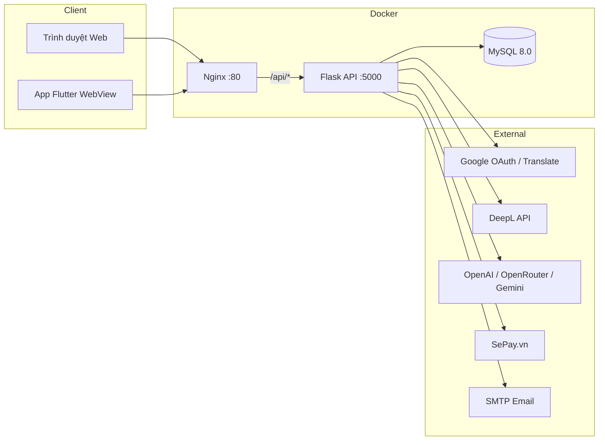

# Tài liệu thông tin thư viện / công nghệ

Tài liệu mô tả **stack công nghệ**, **thư viện phụ thuộc** và **dịch vụ bên ngoài** được sử dụng trong dự án **AI Translation System — Giữ Định Dạng Gốc**.

---

## 1. Tổng quan kiến trúc

Hệ thống gồm ba thành phần chính:

| Thành phần | Thư mục | Vai trò |
|------------|---------|---------|
| **Backend API** | `api_base/` | REST API: xác thực, dịch văn bản/tài liệu/ảnh, thanh toán, lịch sử |
| **Frontend Web** | `frontend/` | Giao diện người dùng (HTML/CSS/JS tĩnh), phục vụ qua Nginx |
| **Mobile App** | `app_web_view/` | Ứng dụng Flutter bọc WebView, hỗ trợ Google OAuth native |



---

## 2. Ngôn ngữ & môi trường chạy

| Công nghệ | Phiên bản yêu cầu | Ghi chú |
|-----------|-------------------|---------|
| **Python** | 3.10+ | Backend API, pipeline xử lý tài liệu |
| **Node.js** | (tùy chọn) | Phát triển frontend local (`http.server`) |
| **Dart / Flutter** | SDK ^3.10.7 | Ứng dụng mobile `app_web_view` |
| **MySQL** | 8.0 | Cơ sở dữ liệu chính; có fallback SQLite khi dev |
| **Docker & Docker Compose** | 3.8+ | Triển khai đa container (khuyến nghị) |

---

## 3. Backend — Python / Flask

### 3.1. Framework & lõi web

| Thư viện | Phiên bản | Mục đích |
|----------|-----------|----------|
| [Flask](https://flask.palletsprojects.com/) | 3.1.2 | Web framework REST API |
| [Werkzeug](https://werkzeug.palletsprojects.com/) | 3.1.5 | WSGI utilities (upload file, bảo mật) |
| [Flask-CORS](https://flask-cors.readthedocs.io/) | 6.0.2 | CORS cho frontend gọi API |
| [Flask-JWT-Extended](https://flask-jwt-extended.readthedocs.io/) | 4.7.1 | JWT authentication |
| [python-dotenv](https://github.com/theskumar/python-dotenv) | 1.2.1 | Đọc biến môi trường từ `.env` |
| [itsdangerous](https://itsdangerous.palletsprojects.com/) | (kèm Flask) | Token OAuth state (URLSafeTimedSerializer) |

**Cấu trúc backend:**

- `run_api.py` — Entry point, đăng ký Blueprint, phục vụ static frontend (dev)
- `app/routers/` — Các module API: `auth`, `translation`, `payment`, `history`, `ai`, `admin`, `contact`, `public`
- `app/services/` — Logic nghiệp vụ: dịch, file, PDF/DOCX, email, thanh toán
- `app/models/` — SQLAlchemy ORM
- `app/security/` — JWT middleware

### 3.2. Cơ sở dữ liệu

| Thư viện | Phiên bản | Mục đích |
|----------|-----------|----------|
| [Flask-SQLAlchemy](https://flask-sqlalchemy.palletsprojects.com/) | 3.1.1 | ORM tích hợp Flask |
| [SQLAlchemy](https://www.sqlalchemy.org/) | (dependency) | Truy vấn DB, migration bootstrap |
| [PyMySQL](https://pymysql.readthedocs.io/) | 1.1.0 | Driver MySQL (`mysql+pymysql://`) |

**Bảng chính** (xem `api_base/init_db.sql`):

- `user`, `user_preference`, `user_login_log`
- `translation` (text / document / image)
- `payment`, `payment_transaction`
- `contact_message`, `admin_setting`

SQLite được dùng tự động khi MySQL/XAMPP không khả dụng (dev).

### 3.3. Xác thực & bảo mật

| Thư viện / Dịch vụ | Mục đích |
|--------------------|----------|
| [google-auth](https://googleapis.dev/python/google-auth/) | 2.47.0 — Xác minh Google ID token |
| [google-auth-oauthlib](https://google-auth-oauthlib.readthedocs.io/) | 1.2.4 — OAuth 2.0 flow |
| Flask-JWT-Extended | Phát hành / xác thực JWT (hết hạn 30 ngày) |
| Werkzeug `generate_password_hash` | Hash mật khẩu (đăng ký email/password) |

### 3.4. Dịch thuật & AI

| Thư viện | Phiên bản | Mục đích |
|----------|-----------|----------|
| [openai](https://github.com/openai/openai-python) | 2.15.0 | SDK gọi OpenAI API hoặc OpenRouter (Gemini, GPT…) |
| [deepl](https://github.com/DeepLcom/deepl-python) | 1.27.0 | DeepL Translation API |
| [googletrans](https://py-googletrans.readthedocs.io/) | 4.0.0rc1 | Google Translate không chính thức (fallback) |
| [requests](https://requests.readthedocs.io/) | 2.32.5 | HTTP client (SePay, Gemini direct, v.v.) |
| [httpx](https://www.python-httpx.org/) | ≥0.27 | HTTP client async-capable (dependency dự phòng) |

**Nhà cung cấp dịch được hỗ trợ** (cấu hình qua `.env`):

| Provider | Biến môi trường | Ghi chú |
|----------|-----------------|---------|
| Google Translate | — | Qua `googletrans` |
| DeepL | `DEEPL_API_KEY` | Map mã ngôn ngữ ISO → DeepL |
| OpenAI | `OPENAI_API_KEY` | GPT models |
| OpenRouter | `OPENROUTER_API_KEY`, `AI_PROVIDER=openrouter` | Gateway tới Gemini 2.5 Flash và model khác |
| Gemini (trực tiếp) | `GEMINI_API_KEY`, `GEMINI_MODEL` | Google Generative AI |

### 3.5. Xử lý tài liệu (Word, PDF, Excel, PowerPoint)

| Thư viện | Phiên bản | Mục đích |
|----------|-----------|----------|
| [python-docx](https://python-docx.readthedocs.io/) | 1.2.0 | Đọc/ghi DOCX, giữ paragraph/run/style/bảng |
| [PyMuPDF (fitz)](https://pymupdf.readthedocs.io/) | ≥1.24.0 | Phân tích PDF, OCR scan, render trang, overlay |
| [pdf2docx](https://github.com/dothinking/pdf2docx) | 0.5.7 | Chuyển PDF → DOCX (giữ layout) |
| [docx2pdf](https://github.com/AlJohri/docx2pdf) | 0.1.8 | Xuất DOCX → PDF qua Microsoft Word (Windows) |
| [beautifulsoup4](https://www.crummy.com/software/BeautifulSoup/) | 4.12.2 | Parse HTML/XML trong tài liệu Office |
| [Pillow](https://pillow.readthedocs.io/) | 10.4.0 | Xử lý ảnh (OCR, overlay) |
| [opencv-python-headless](https://opencv.org/) | ≥4.10.0 | Deskew, enhance, xử lý ảnh scan |
| [numpy](https://numpy.org/) | ≥2.1.0 | Ma trận ảnh cho OpenCV |

**Pipeline PDF** (`app/services/document_v2/pdf_docx_pipeline/`):

1. Phân tích PDF (text/scan, bảng, cột, ảnh)
2. OCR scan → searchable PDF (Tesseract + PyMuPDF)
3. Làm sạch PDF (xoay, deskew, enhance)
4. PDF → DOCX (`pdf2docx`)
5. Dịch DOCX (giữ định dạng)
6. Khôi phục layout (`layout_recovery.py`)
7. DOCX → PDF (`docx2pdf` hoặc LibreOffice)

**Font nhúng:** Noto Sans (`api_base/fonts/`) — hỗ trợ Unicode/tiếng Việt khi overlay PDF.

### 3.6. OCR (ảnh & PDF scan)

| Thư viện / Công cụ | Mục đích |
|--------------------|----------|
| [pytesseract](https://github.com/madmaze/pytesseract) | 0.3.10 — Python wrapper cho Tesseract |
| **Tesseract OCR** (binary hệ thống) | Engine OCR; cài `eng` + `vie` |
| Tessdata | `api_base/tessdata/eng.traineddata`, `vie.traineddata` |
| OpenCV + Pillow | Tiền xử lý ảnh trước OCR |
| AI Vision (`AI_VISION_MODEL`) | OCR/dịch ảnh qua Gemini (tùy chọn) |

Biến môi trường: `TESSERACT_CMD`, `OCR_LANGS_DEFAULT=eng+vie`

### 3.7. Email & liên hệ

| Thành phần | Mục đích |
|------------|----------|
| `smtplib` (stdlib) | Gửi email SMTP |
| `email.mime` (stdlib) | MIME multipart |
| Cấu hình | `SMTP_HOST`, `SMTP_PORT`, `SMTP_USER`, `SMTP_PASSWORD`, `ADMIN_EMAIL` |

### 3.8. Thanh toán

| Thành phần | Mục đích |
|------------|----------|
| [requests](https://requests.readthedocs.io/) | Gọi SePay User API (polling giao dịch) |
| SePay.vn | Xác nhận chuyển khoản, webhook |
| VietQR / SePay QR | Tạo mã QR chuyển khoản |

---

## 4. Frontend Web

### 4.1. Công nghệ cốt lõi

| Công nghệ | Mô tả |
|-----------|-------|
| **HTML5** | Cấu trúc trang (`frontend/pages/`) |
| **CSS3** | Theme dark, glassmorphism, responsive (`frontend/css/`) |
| **JavaScript ES6+** | Logic client (`frontend/js/`), không dùng framework SPA |
| **Fetch API** | Gọi REST API backend |

### 4.2. Thư viện & tài nguyên frontend

| Thư viện / Dịch vụ | Vị trí / Nguồn | Mục đích |
|--------------------|----------------|----------|
| [Font Awesome](https://fontawesome.com/) | `frontend/libs/fontawesome/` | Icon UI |
| [Google Fonts — Inter](https://fonts.google.com/specimen/Inter) | CDN `fonts.googleapis.com` | Typography |
| Module JS nội bộ | `i18n.js`, `auth_state.js`, `languages.js`, `dashboard.js`, … | Đa ngôn ngữ UI, auth, dashboard dịch |

### 4.3. Triển khai frontend

| Công nghệ | Phiên bản | Mục đích |
|-----------|-----------|----------|
| [Nginx](https://nginx.org/) | Alpine (Docker) | Phục vụ static, gzip, reverse proxy `/api/` → backend |
| Dockerfile | `frontend/Dockerfile` | Build image Nginx |

**Các trang chính:** `home`, `dashboard`, `auth`, `profile`, `history`, `admin`, `contact`, `installation`, `user-guide`, …

---

## 5. Mobile App — Flutter

Ứng dụng bọc frontend web trong WebView, xử lý OAuth Google native.

| Package | Phiên bản | Mục đích |
|---------|-----------|----------|
| [webview_flutter](https://pub.dev/packages/webview_flutter) | ^4.10.0 | Nhúng web vào app |
| [webview_flutter_android](https://pub.dev/packages/webview_flutter_android) | ^4.11.0 | WebView Android |
| [flutter_web_auth_2](https://pub.dev/packages/flutter_web_auth_2) | ^4.0.0 | Custom Tab / Safari View cho OAuth |
| [google_sign_in](https://pub.dev/packages/google_sign_in) | ^6.2.2 | Đăng nhập Google native |
| [http](https://pub.dev/packages/http) | ^1.2.0 | HTTP requests |
| [shared_preferences](https://pub.dev/packages/shared_preferences) | ^2.3.0 | Lưu token an toàn |
| [file_picker](https://pub.dev/packages/file_picker) | ^11.0.2 | Chọn file upload |
| [cupertino_icons](https://pub.dev/packages/cupertino_icons) | ^1.0.8 | Icon iOS style |

**Dev dependencies:** `flutter_lints`, `flutter_launcher_icons`

**Nền tảng hỗ trợ:** Android, iOS, Web, Windows, Linux, macOS (cấu trúc Flutter mặc định).

---

## 6. DevOps & hạ tầng

### 6.1. Docker Compose

File: `docker-compose.yml`

| Service | Image / Build | Port | Vai trò |
|---------|---------------|------|---------|
| `backend` | `api_base/Dockerfile` (Python 3.10-slim) | 5000 | Flask API + Tesseract OCR |
| `frontend` | `frontend/Dockerfile` (nginx:alpine) | 80 | Static web + API proxy |
| `db` | `mysql:8.0` | 3306 | Database |

Volume: `mysql_data`, mount upload/download folders.

### 6.2. Công cụ hệ thống (ngoài pip)

| Công cụ | Bắt buộc | Mục đích |
|---------|----------|----------|
| **Tesseract OCR** | Có (OCR) | Cài trong Docker; Windows cần cài riêng |
| **Microsoft Word** | Tùy chọn | `docx2pdf` trên Windows |
| **LibreOffice** | Tùy chọn | Xuất DOCX → PDF (`soffice --headless`) |
| **ngrok** | Tùy chọn | Tunnel HTTPS cho OAuth dev (`NGROK_SETUP.md`) |

### 6.3. Script & công cụ phát triển

| Công cụ | Mục đích |
|---------|----------|
| XAMPP / phpMyAdmin | Quản lý MySQL local |
| Python venv | Môi trường ảo backend |
| Live Server / `python -m http.server` | Dev frontend local |

---

## 7. Dịch vụ bên ngoài (External APIs)

| Dịch vụ | Endpoint / Tích hợp | Chức năng |
|---------|---------------------|-----------|
| **Google OAuth 2.0** | `GOOGLE_CLIENT_ID`, callback `/api/auth/google/callback` | Đăng nhập người dùng |
| **Google Translate** | `googletrans` | Dịch văn bản (miễn phí, không chính thức) |
| **DeepL API** | `api.deepl.com` | Dịch chất lượng cao |
| **OpenAI API** | `api.openai.com` | Dịch qua GPT |
| **OpenRouter** | `openrouter.ai/api/v1` | Gateway AI (Gemini 2.5 Flash, …) |
| **Google Gemini** | Generative Language API | Dịch / vision OCR |
| **SePay.vn** | `my.sepay.vn`, webhook `/api/payment/sepay/webhook` | Xác nhận thanh toán |
| **VietQR / img.vietqr.io** | QR chuyển khoản | Hiển thị mã QR nạp token |
| **SMTP (Gmail, …)** | Cấu hình SMTP | Thông báo form liên hệ |

---

## 8. Bảo mật

| Biện pháp | Công nghệ |
|-----------|-----------|
| JWT Bearer token | Flask-JWT-Extended |
| OAuth 2.0 | Google Sign-In |
| CORS | Flask-CORS |
| Hash mật khẩu | Werkzeug PBKDF2 |
| SQL injection prevention | SQLAlchemy ORM (parameterized) |
| Upload giới hạn | `MAX_CONTENT_LENGTH = 50MB` |
| Webhook auth | Header `Authorization: Apikey <SEPAY_WEBHOOK_API_KEY>` |

---

## 9. Tóm tắt dependency theo file

### Backend — `api_base/requirements.txt`

```
Flask==3.1.2
Flask-JWT-Extended==4.7.1
Flask-Cors==6.0.2
python-dotenv==1.2.1
Flask-SQLAlchemy==3.1.1
PyMySQL==1.1.0
google-auth==2.47.0
google-auth-oauthlib==1.2.4
requests==2.32.5
httpx>=0.27,<1.0
openai==2.15.0
deepl==1.27.0
googletrans==4.0.0rc1
python-docx==1.2.0
beautifulsoup4==4.12.2
Werkzeug==3.1.5
pytesseract==0.3.10
Pillow==10.4.0
opencv-python-headless>=4.10.0.0
numpy>=2.1.0
PyMuPDF>=1.24.0
pdf2docx==0.5.7
docx2pdf==0.1.8
```

### Mobile — `app_web_view/pubspec.yaml`

```
webview_flutter: ^4.10.0
webview_flutter_android: ^4.11.0
flutter_web_auth_2: ^4.0.0
http: ^1.2.0
shared_preferences: ^2.3.0
google_sign_in: ^6.2.2
file_picker: ^11.0.2
cupertino_icons: ^1.0.8
```

---

## 10. Tài liệu liên quan

| Tài liệu | Nội dung |
|----------|----------|
| [README.md](../README.md) | Tổng quan dự án |
| [docs/INSTALLATION_GUIDE.md](./INSTALLATION_GUIDE.md) | Hướng dẫn cài đặt |
| [docs/DOCUMENT_TRANSLATION_FLOW.md](./DOCUMENT_TRANSLATION_FLOW.md) | Luồng dịch PDF/DOCX |
| [docs/SEPAY_INTEGRATION.md](./SEPAY_INTEGRATION.md) | Tích hợp thanh toán |
| [docs/DATABASE_SETUP.md](./DATABASE_SETUP.md) | Cấu hình MySQL |
| [QUY_TRINH_DICH_FILE.md](../QUY_TRINH_DICH_FILE.md) | Quy trình dịch file (VI) |
| [app_web_view/README.md](../app_web_view/README.md) | Hướng dẫn app Flutter |

---

*Tài liệu được tổng hợp từ mã nguồn và cấu hình dự án. Cập nhật lần cuối: tháng 6/2026.*
